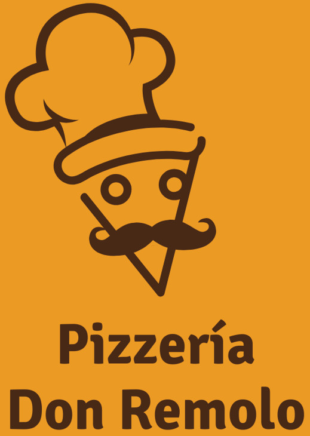

</div>
<div style="border-radius: 50%;" align="center">
 

</div>


<div align="center">
<a href="https://git.io/typing-svg"></a> <br>
 <a href="https://git.io/typing-svg"></a>


## Getting Started

To get started with this project, follow these steps:

1. **Clone the Repository:**

   ```bash
   git clone https://github.com/yourusername/pizzeria-clean-architecture.git
   cd pizzeria-clean-architecture

2. **Install Dependencies:**

   ```bash
   npm install

3. **Run the Application:**
    npm start

# 🤹Development Team

<!-- Desarrollador  - UX/UI -->
<p align="center">    
    <span style="font-weight: bold;">UX/UI</span>
    <br>
    <a href="https://www.linkedin.com/in/gabriela-cavallo-arregui/"></a>
<!--     <a href="https://portfolio3.dev/"></a>
    <a href="mailto:developer3@gmail.com">
        
    </a> -->
</p>


<!-- Desarrollador  - Front-End -->
<p align="center">    
    <span style="font-weight: bold;">Front-End</span>
    <br>
    <a href="https://www.linkedin.com/in/tatianacordecci/"></a>
    <a href="https://portfolio2.dev/"></a>
<!--     <a href="mailto:developer2@gmail.com">
        
    </a> -->
</p>

<!-- Desarrollador  - Back-End -->
<p align="center">    
    <span style="font-weight: bold;">Back-End</span>
    <br>
    <a href="https://www.linkedin.com/in/juandebandi/"></a>
    <a href="https://juandebandi.dev/"></a>
    <a href="mailto:juudinidev@gmail.com">
        
    </a>
</p>

# Pizzeria eCommerce

Welcome to the Pizzeria eCommerce project. This application is an online platform that allows users to order and customize pizzas to their liking. It's a comprehensive solution that incorporates Clean Architecture, Domain-Driven Design (DDD), and follows the principles of Clean Code to ensure that the codebase is highly maintainable and scalable.

## Key Features

- **Customized Ordering:** Users can create and customize their own pizzas by choosing ingredients, size, and more.
- **Varied Menu:** We offer a wide range of pre-defined pizzas and other related products.
- **Intuitive User Experience:** We've worked on a user-friendly experience to make ordering easy and enjoyable.

This project is a collaboration among a team of developers, user experience designers, and user interface designers, and we're excited to share it with you. We hope you enjoy your time at our online pizzeria!

## License

This project is licensed under the MIT License. See the [LICENSE](LICENSE) file for more details.
